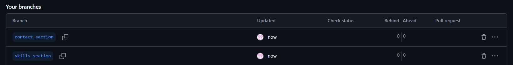

# Отчет по работе в команде

**Дата:** [30.09.2025]  
**Команда:** [Кирилл,Евгений]
## Распределение задач:
- **Студент 1:** [Кирилл] - раздел "Навыки"
- **Студент 2:** [Евгений] - раздел "Контакты"

## Выполненные действия:

### Создание веток:
- Ветка студента 1: `add-skills-section` ✅
- Ветка студента 2: `add-contacts-section` ✅

### Реализация функционала:
- [+] Студент 1: раздел "Навыки" добавлен
- [+] Студент 2: форма "Контакты" добавлена

### Коммиты:
- Сообщение коммита студента 1: []
- Сообщение коммита студента 2: [Add files via upload]
- [+] Оба коммита отправлены на GitHub

## Проверка работы:
1. Переключитесь между ветками: `git checkout [1111]`
2. [+] В каждой ветке видны только соответствующие изменения
3. [+] Страница работает корректно в каждой ветке

## Скриншоты:
[]

## Проблемы и решения:
[Опишите проблемы при работе с ветками]

## Вывод:
[Что узнали о работе с ветками в Git]